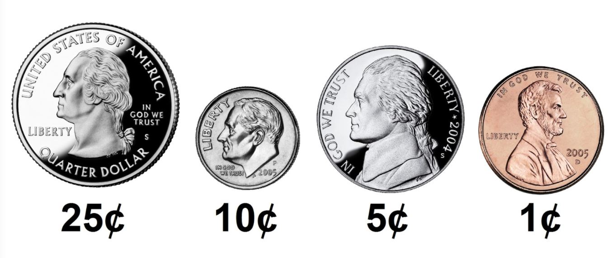

# Cash (Greedy Algorithm)

When making change, odds are you want to minimize the number of coins you’re dispensing for each customer, lest you run out (or annoy the customer!). Fortunately, computer science has given cashiers everywhere ways to minimize numbers of coins due: greedy algorithms.

According to the National Institute of Standards and Technology (NIST), a greedy algorithm is one “that always takes the best immediate, or local, solution while finding an answer. Greedy algorithms find the overall, or globally, optimal solution for some optimization problems, but may find less-than-optimal solutions for some instances of other problems.”

What’s all that mean? Well, suppose that a cashier owes a customer some change and in that cashier’s drawer are quarters (25¢), dimes (10¢), nickels (5¢), and pennies (1¢). The problem to be solved is to decide which coins and how many of each to hand to the customer. Think of a “greedy” cashier as one who wants to take the biggest bite out of this problem as possible with each coin they take out of the drawer. For instance, if some customer is owed 41¢, the biggest first (i.e., best immediate, or local) bite that can be taken is 25¢. (That bite is “best” inasmuch as it gets us closer to 0¢ faster than any other coin would.) Note that a bite of this size would whittle what was a 41¢ problem down to a 16¢ problem, since 41 - 25 = 16. That is, the remainder is a similar but smaller problem. Needless to say, another 25¢ bite would be too big (assuming the cashier prefers not to lose money), and so our greedy cashier would move on to a bite of size 10¢, leaving him or her with a 6¢ problem. At that point, greed calls for one 5¢ bite followed by one 1¢ bite, at which point the problem is solved. The customer receives one quarter, one dime, one nickel, and one penny: four coins in total.

It turns out that this greedy approach (i.e., algorithm) is not only locally optimal but also globally so for America’s currency (and also the European Union’s). That is, so long as a cashier has enough of each coin, this largest-to-smallest approach will yield the fewest coins possible. How few? Well, you tell us!
